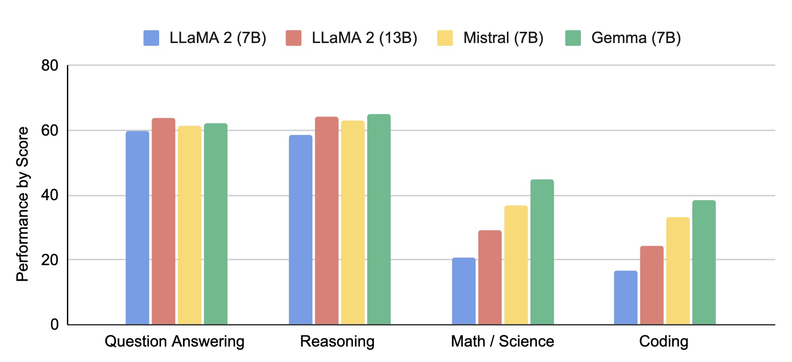
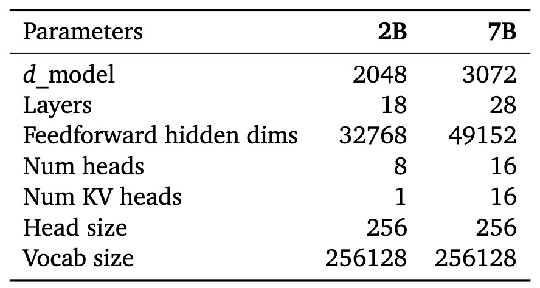
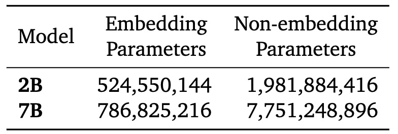
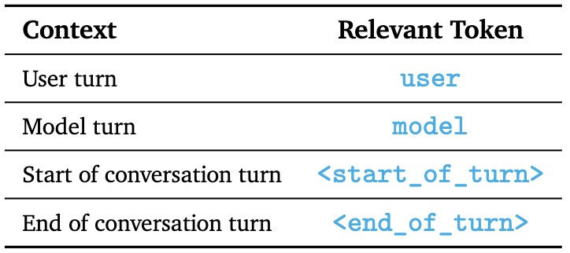
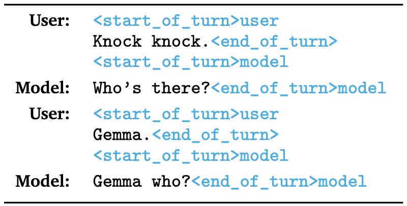

# Google开源大语言模型Gemma技术解读

## Gemma 简介

Gemma 是由 Google DeepMind 团队发布的一款基于 Gemini 模型的轻量级、性能达到最好的开源模型，在自然语言理解、推理以及安全性相关的多个基准上表现出强大的性能，在不同任务上的表现如下图所示。目前，Gemma 发布了 2B 参数和 7B 参数两个版本的模型，并且提供了预训练以及微调的 checkpoints。论文原文为 [Gemma: Open Models Based on Gemini Research and Technology](https://storage.googleapis.com/deepmind-media/gemma/gemma-report.pdf)

## 模型结构

Gemma使用了 Transformer decoder 作为模型结构，上下文长度限制在 8192 个 token。对于不同参数版本的模型，超参数设置具体如下表所示：

 

- Multi-Query Attention: 7B 模型使用了 multi-head attention，2B 模型使用了 multi-query attention，消融实验表明，各自的 attention 变体都提升了每个参数版本模型的性能。
- RoPE Embeddings：使用了旋转位置编码，并且输入和输出共享 embedding。
- GeGLU Activations：使用了 GeGLU作 为激活函数。
- Normalizer Location：对每个 Transformer 子层的输入和输出都进行了归一化，并且使用了 RMSNorm 作为归一化层。

## 预训练

- Training Data：对于 2B 和 7B 模型分别使用了 2T 和 6T tokens的数据进行训练。使用了 SentencePiece tokenizer，对于未知的 token，使用 byte-level 的 encodings，词典大小是 256k tokens。
- Filtering：过滤掉的数据包括不需要、不安全的句子，还有包含个人信息以及敏感的数据。包括同时使用启发式和基于模型的分类器来消除有害或低质量的内容。对于测试集，从预训练混合数据集中进行过滤。他们在整个训练过程中进行阶段训练以改变语料库混合，以增加相关、高质量的数据对训练结束时的权重。

## 指令微调

在纯文本、仅英语合成和人工生成的提示响应对的混合以及来自人类反馈 (RLHF) 的强化学习上微调 Gemma 2B 和 7B，奖励模型基于标记的英语偏好数据和基于一组高质量提示的策略。通过实验可以发现这两个阶段对于提高模型输出下游自动评估和用户偏好评估的性能都很重要。

- Supervised Fine-Tuning: 基于LM的并排评估选择了数据混合进行监督微调。给定一组保留的提示，使用测试模型生成回复，从基线模型生成相同提示的回复，随机打乱这些，并要求更大、高容量的模型表达两个响应之间的偏好。构建不同的提示集以突出特定的功能，例如指令跟随、事实性、创造力和安全性。同时使用多种技术，例如思维链提示和规定的使用来对齐人类偏好。
- Filtering: 在使用合成数据时，进行了几个阶段的过滤，删除了显示某些个人信息、不安全或有毒模型输出的示例、错误的自我识别数据或重复示例。
- Formatting: 指令调整模型使用特定的格式进行训练，该格式在训练和推理时都使用额外的信息注释所有指令调整示例。这样有两个目的：1）表示对话中的角色，例如用户角色，2）描述对话中的轮次，尤其是在多轮对话中。因此，特殊的 token 在 tokenizer 中被保留。尽管不用格式也能连贯的生成，但是很有可能产生错误的生成。相关的格式控制 token 如下所示：

## 基于人类反馈的强化学习（RLHF）

使用RLHF进一步微调Supervised Fine-Tuning后的模型，通过收集来自人类评估者的偏好对，并且在 [Bradley-Terry](https://www.jstor.org/stable/2334029?origin=crossref) 模型下训练奖励函数，该策略经过训练，可以使用 [REINFORCE](https://link.springer.com/article/10.1007/BF00992696) 的变体来优化这个奖励函数，并对初始调整的模型使用Kullback-Leibler正则化项。
